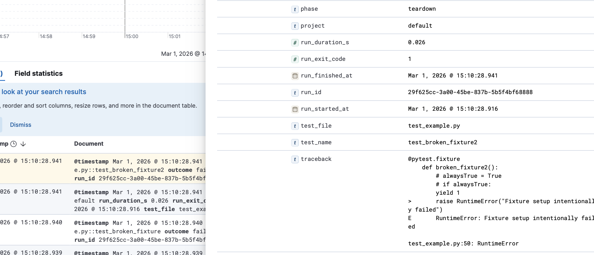

# pytest-elastic-reporter

A simple pytest plugin that reports test results to Elasticsearch.



## Installation

### Via pip (once published)

```bash
uv pip install pytest-elastic-reporter
```

> **Important:** Pin the `elasticsearch` client to match your server's major version or you will get a `media_type_header_exception`:
>
> ```bash
> pip install "elasticsearch>=8,<9"   # for Elasticsearch 8.x
> ```

## Usage

```bash
# Or pass everything via CLI
pytest --es-url http://elastic-cluster:9200 \
       --es-index pytest-results \
       --api-project my-app-tests \
       --es-username elastic \
       --es-password changeme
```

> Note: When a fixture raises an exception during `setup`, the test body never runs. These results will have `phase: "setup"`, `outcome: "failed"`, and `fixture_error: true` — making them easy to filter separately in Kibana.
